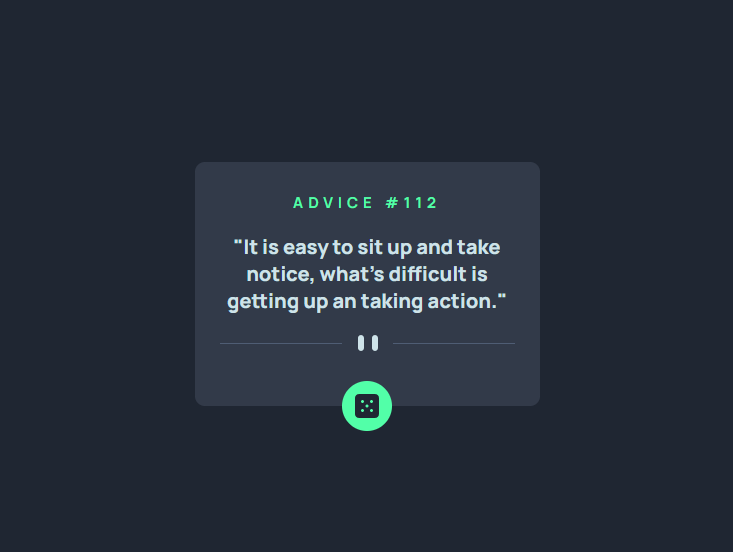
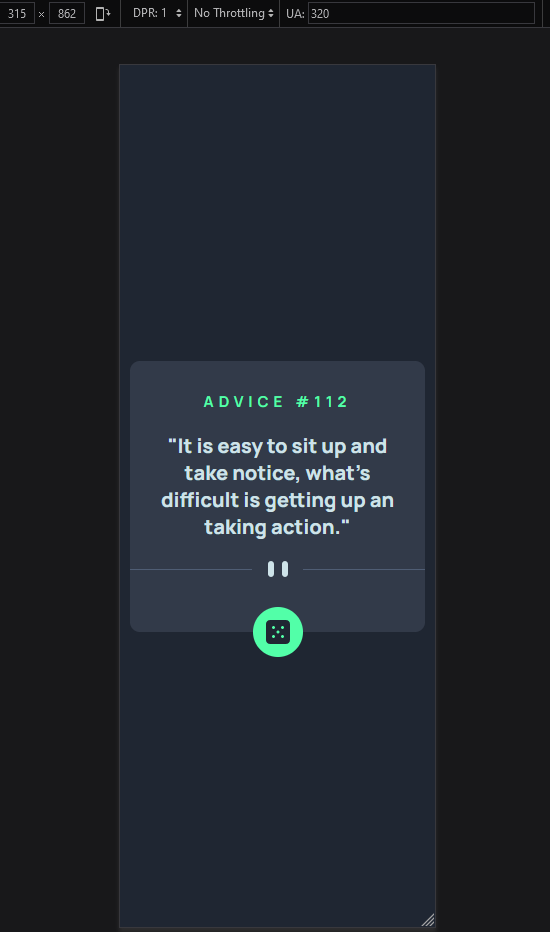

# ⚡ Challenge - Frontend Mentor = Advice Card (App de Conselhos)

## 📝 Descrição do Projeto
Criar um layout próximo desse desafio do frontend mentor: [Frontend Mentor | Advice generator app coding challenge](https://www.frontendmentor.io/challenges/advice-generator-app-QdUG-13db). Onde o principal desafio é construir um aplicativo que selecione um conselho aleatórios de um banco de conselhos. 


## 🔎 Funcionalidades
- Responsivo para todos os dispositivos
- Construção do HTML e CSS


## 🛠️ Ferramentas utilizadas
- **HTML:** Estruturação do projeto
- **CSS:** Estilização do projeto, responsivo
- **Git:** Ferramenta de versionamento


## 🎨 Imagens do projeto

### Imagens do Design a ser seguido
<div align="center">
 <br>

</div>

## Imagens do Design criado
<div align="center">
 <br>

</div>


## 💡 Decisões do projeto
1. **Fontes**
- [Manrope](https://fonts.google.com/specimen/Manrope)
- [Kumbh Sans](https://fonts.google.com/specimen/Kumbh+Sans)
- [Roboto](https://fonts.google.com/specimen/Roboto)

2. **Cores**
```
--text-color: hsl(193, 38%, 86%);
--advice-dice-color: hsl(150, 100%, 66%);
--advice-card-color: hsl(217, 19%, 24%);
--background-color: hsl(218, 23%, 16%);
```


## 💦 Dificuldades do projeto
- Seguir os padrões sem as informações de fontes, cores e tamanhos.


## 🔓 O que eu aprendi
- Com auxílio de IA é possível encontrar as cores e fontes similares para a execução do projeto.


## 💭 Possíveis atualizações futuras
- Finalizar o README ✅
- Criar o banco de conselhos.
- Criar o mecanismo de selecionar um conselho aleatório.
- Dispor o conselho selecionado em tela.

## 🚀 Como rodar o projeto
Siga os passos abaixo para executar o projeto na sua máquina:

### Pré requisitos

- <strong><i>Git</i></strong>: Para clonar o repositório.


1. Abra o git, e execute os seguintes comandos
2. **Clonar o repositório:**
   ```bash
   git clone https://github.com/cezarviana/challenge-frontend-mentor-advice-card.git
   ```
3. npm install
4. npm run dev
5. **Abrir o arquivo index.html:** Abra o arquivo `index.html` em um navegador web.
